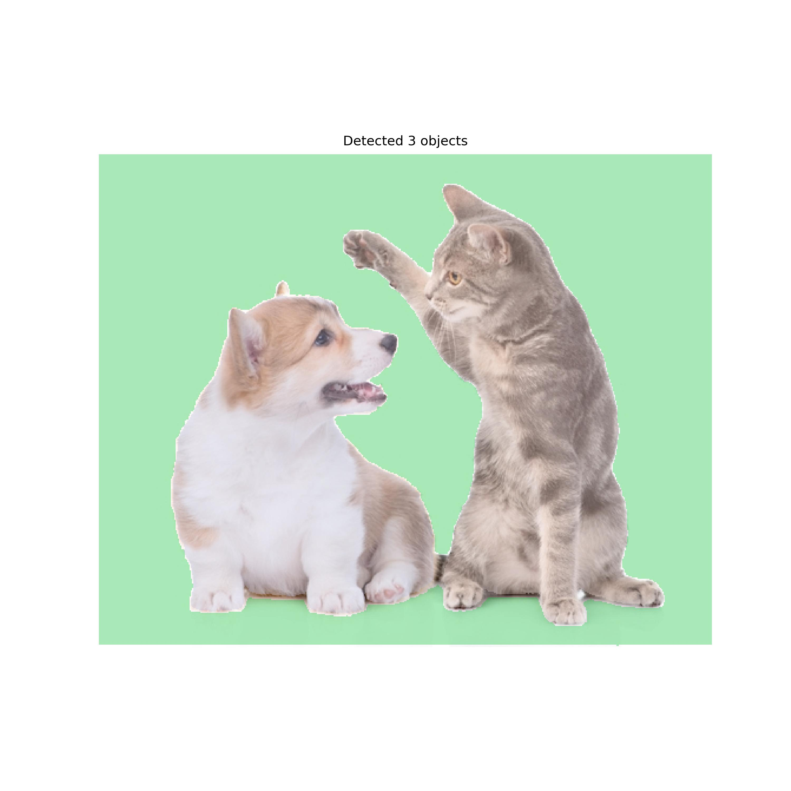
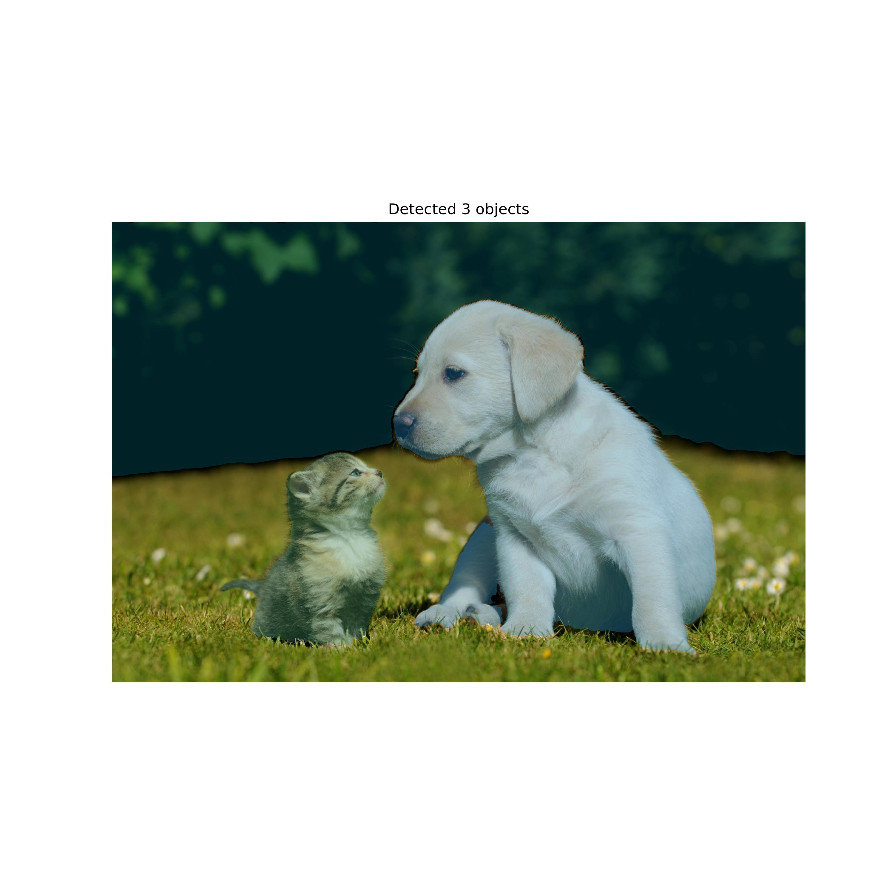

# Fourier Drawing from Images

|Image|Masks|Fourier Drawing|
|---|---|---|
|  |  |  |
|  |  |  |

---

## 1. Overview

This project is a pipeline that separates objects from an input image,
represents each object’s contour using Fourier Epicycles,
and generates a GIF transparently composited over the original image.

---

## 2. Mathematical Formulation

### 2.1 Contour Representation

The object’s contour is uniformly resampled and expressed as a closed curve:

$C=\{ (x_n,y_n)\} _{n=0}^{N-1}$

This is then converted into a complex signal:

$z_n=(x_n-\bar {x})+i(y_n-\bar {y})$

where $(\bar {x},\bar {y})$ denotes the actual centroid coordinates of the object.

---

### 2.2 Discrete Fourier Transform

$a_k=\frac{1}{N}\sum _{n=0}^{N-1}z_ne^{-i2\pi kn/N}$

- $a_k$: the k-th Fourier coefficient
- Low $|k|$: captures the overall shape
- High $|k|$: captures fine details of the contour

---

### 2.3 Epicycle Reconstruction

The reconstructed signal at time $t\in [0,1]$ is given by:

$z(t)=\sum _{k=-K}^Ka_ke^{i2\pi kt}$

Restored into the global coordinate system:

$z_{\mathrm{global}}(t)=z(t)+(x_c+iy_c)$

---

### 3. Segmentation
Segmentation is the task of dividing an image into meaningful regions, typically to identify and separate individual objects from the background or from each other.

In this project, I used the SAM model to perform image segmentation.\
When the image domain is not predefined, I considered a zero-shot approach to be appropriate for distinguishing objects.

However, if the domain is fixed, domain-specific models such as Mask R-CNN or U-Net may be more appropriate. These models might achieve higher accuracy or more stable performance within a specialized setting.

---

## 4. Usage

### 4.1 Example
```bash
python main.py

python main.py amg=test

python main.py amg=test img_path=data/example.jpg amg.pred_iou_thresh=0.91
```

---

### 4.2 SAM Model Post-processing Parameters

| Parameter | Default | Recommended | Description |
|-----------|---------|-------------|-------------|
| points_per_side | 32 | 32–64 | Number of points sampled along each image side for initial mask generation. Higher values increase mask detail. |
| pred_iou_thresh | 0.88 | 0.85–0.95 | Minimum IOU for predicted masks to be kept; higher values filter out uncertain masks. |
| stability_score_thresh | 0.95 | 0.90–0.97 | Minimum stability score required for a mask. |
| stability_score_offset | 1.0 | 1.0 | Offset applied in stability score computation. |
| box_nms_thresh | 0.7 | 0.5-0.8 | NMS threshold for predicted bounding boxes; lower values reduce overlapping boxes. |
| crop_n_layers | 0 | 1-2 | Number of crop layers for hierarchical segmentation; increase for high-resolution images. |
| crop_nms_thresh | 0.7 | 0.6–0.8 | NMS threshold for masks generated within crops. |
| crop_overlap_ratio | 0.34 | 0.3-0.5 | Maximum allowed overlap between crop masks. |
| crop_n_points_downscale_factor | 1 | 1 | Factor to downscale points per crop. |
| min_mask_region_area | 0 | 50–200 | Minimum pixel area for mask regions; smaller regions are discarded. |